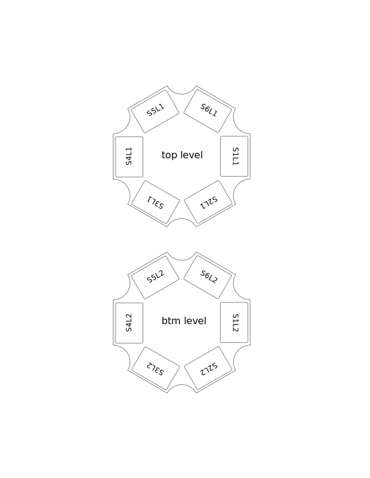

<!-- README.md is generated from README.Rmd. Please edit that file -->

[](https://cran.r-project.org/package=cg12r)
[](https://www.repostatus.org/#active)

```{r, echo = FALSE}
knitr::opts_chunk$set(
  collapse = TRUE,
  comment = "#|",
  fig.path = "README-"
)
```

## usage

```{r}
library(cg12r)
cg12_example("12x96MTP_example.txt")
file <- cg12_example("12x96MTP_example.txt")
data <- read_cg12(file)
data
```


### under development

plot plate-level variables onto the physical carousel layout
```{r, eval=FALSE}
plot_carousel()
# data %>% 
#   group_by(plate) %>% 
#   summarise(nwells = length(unique(well)), nmeas = length(unique(datetime))) %>% 
#   plot_carousel()
```

<p align="center">
  
</p>
