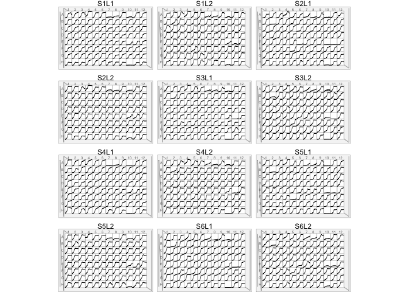

<!-- README.md is generated from README.Rmd. Please edit that file -->

[](https://www.tidyverse.org/lifecycle/#experimental)
[](https://cran.r-project.org/package=readcg12)

Read, ~~Validate~~, ~~Simulate~~ and ~~Write~~ CG-12 instrument
files.

## Installation

<!-- You can install the released version of gp1 from [CRAN](https://CRAN.R-project.org) with: -->

``` r
# install.packages("readcg12") # not yet
remotes::install_github("npjc/readcg12")
```

## Example

``` r
library(readcg12)
file <- cg12_example("12x96MTP_example.txt")
read_cg12(file)
#> # A tibble: 123,744 x 4
#>    plate well  runtime measure
#>    <chr> <chr>   <int>   <dbl>
#>  1 S1L1  A01         0   0.078
#>  2 S1L1  A01      1073   0.078
#>  3 S1L1  A01      2154   0.079
#>  4 S1L1  A01      3235   0.08 
#>  5 S1L1  A01      4316   0.081
#>  6 S1L1  A01      5397   0.082
#>  7 S1L1  A01      6478   0.083
#>  8 S1L1  A01      7558   0.084
#>  9 S1L1  A01      8639   0.086
#> 10 S1L1  A01      9720   0.088
#> # … with 123,734 more rows
read_cg12(file, all_fields = TRUE)
#> # A tibble: 123,744 x 7
#>    instrument  plate well  datetime            runtime measure_type measure
#>    <chr>       <chr> <chr> <dttm>                <int>        <int>   <dbl>
#>  1 CG12-Photo… S1L1  A01   2018-04-19 14:36:36       0          620   0.078
#>  2 CG12-Photo… S1L1  A01   2018-04-19 14:54:29    1073          620   0.078
#>  3 CG12-Photo… S1L1  A01   2018-04-19 15:12:30    2154          620   0.079
#>  4 CG12-Photo… S1L1  A01   2018-04-19 15:30:31    3235          620   0.08 
#>  5 CG12-Photo… S1L1  A01   2018-04-19 15:48:32    4316          620   0.081
#>  6 CG12-Photo… S1L1  A01   2018-04-19 16:06:33    5397          620   0.082
#>  7 CG12-Photo… S1L1  A01   2018-04-19 16:24:34    6478          620   0.083
#>  8 CG12-Photo… S1L1  A01   2018-04-19 16:42:34    7558          620   0.084
#>  9 CG12-Photo… S1L1  A01   2018-04-19 17:00:35    8639          620   0.086
#> 10 CG12-Photo… S1L1  A01   2018-04-19 17:18:36    9720          620   0.088
#> # … with 123,734 more rows
```

-----

### To visualize the parsed output with the `mtpview` pkg:

``` r
library(mtpview)
d <- read_cg12(file)

mtp_ggplot(d, aes(plate = plate, well = well)) + 
  mtp_spec_96well() + 
  geom_footprint() + 
  geom_notched_border() + 
  geom_row_label(size = 1.5) + 
  geom_col_label(size = 1.5)  +
  geom_well_rect(fill = 'white') + 
  geom_well_line(aes(x = runtime, y = measure), size = 0.2) + 
  facet_wrap(~plate, ncol = 3)
```



Info about the carousels

<p align="center">


</p>
